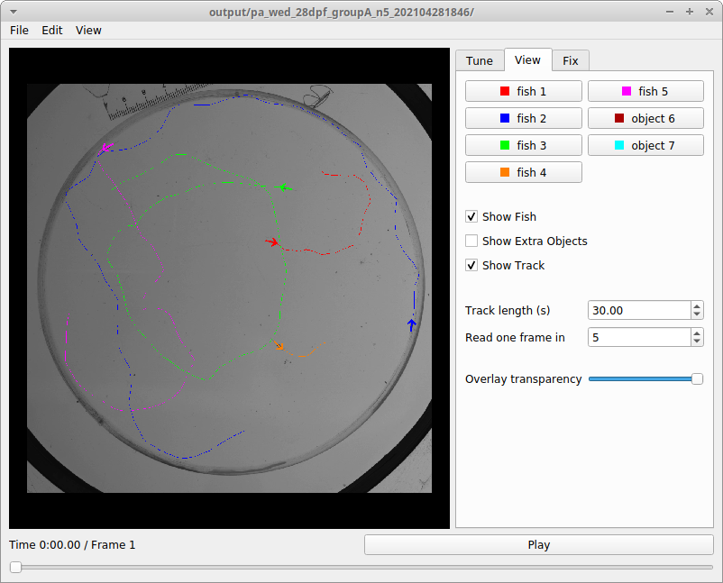
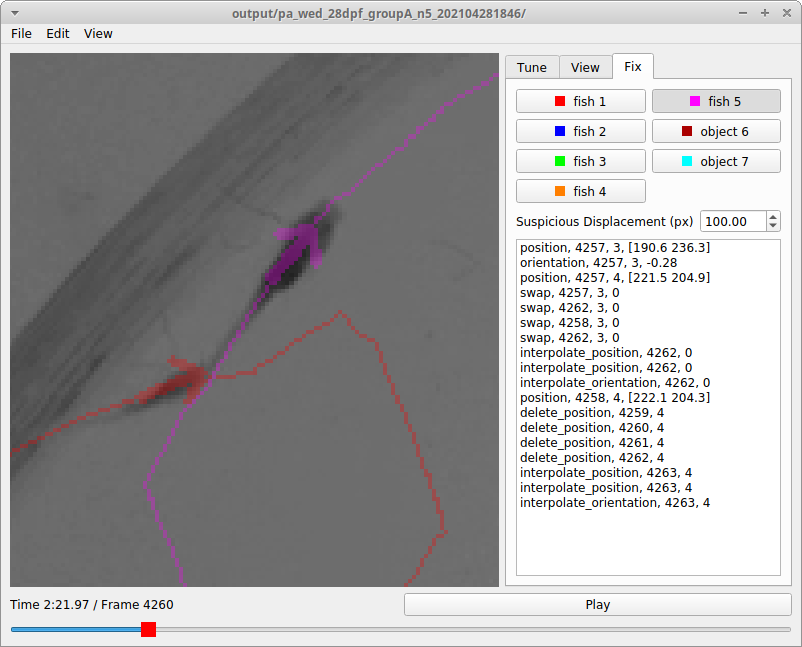

# Trilab-Tracker

## Description

Software to video-track fish (or other objects). Includes a python module, jupyter notebooks for batch tracking and analysis, and a GUI to visualize tracks, tune tracking parameters, and fix tracks by hand.

    
    
    

## Installation and Use

Install [miniconda](https://docs.conda.io/en/latest/miniconda.html). Open a terminal (Linux/Mac) or anaconda prompt (Windows). Navigate to the trilab-tracker folder. Execute `conda env create -f trilab-tracker.yml`.

To use the GUI, open a terminal or anaconda prompt, navigate to the trilab-tracker folder, then execute `python viewer.py`. To use the jupyter notebooks, execute `jupyter notebook` instead.

In Windows, you can bypass the anaconda prompt with this (one-time) extra installation step. Open the anaconda prompt. Execute `where conda`. Copy the line that ends with `condabin\conda.bat`. Open `_conda.bat` as a text file. Replace the path after the equal sign with the line you just copied. Save `_conda.bat` and close it. You should now be able to start the viewer by double-clicking on `_viewer.bat` and start jupyter notebook by double-clicking on `_jupyter.bat`.

## Author

Written by Yaouen Fily.

Offshoot of cvtracer by Adam Patch [https://github.com/patchmemory/cvtracer](https://github.com/patchmemory/cvtracer).

