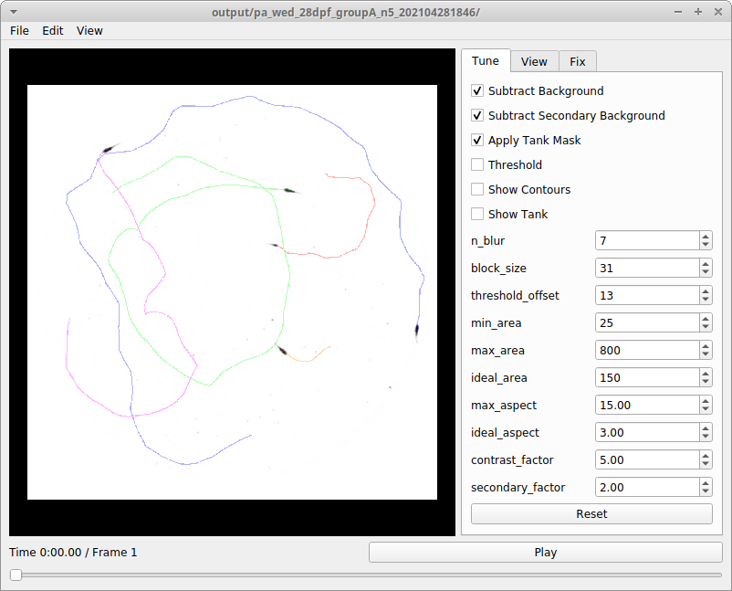

# Trilab-Tracker

## Description

Software to video-track fish (or other objects). Includes a python module, jupyter notebooks for batch tracking and analysis, and a GUI to visualize tracks, tune tracking parameters, and fix tracks by hand.

    
    
    

## Author

Written by Yaouen Fily.

Offshoot of cvtracer by Adam Patch [https://github.com/patchmemory/cvtracer](https://github.com/patchmemory/cvtracer).

